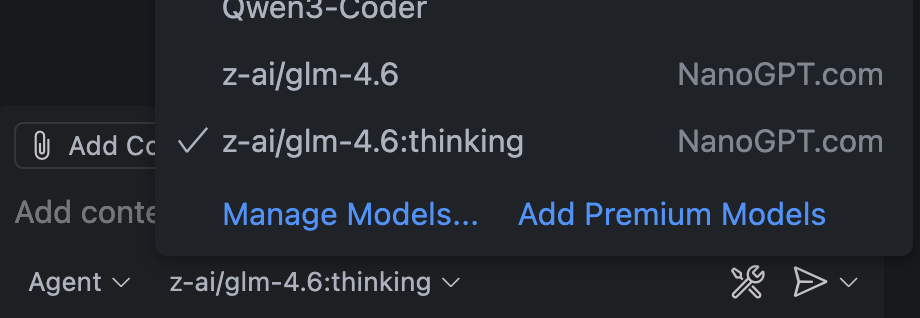
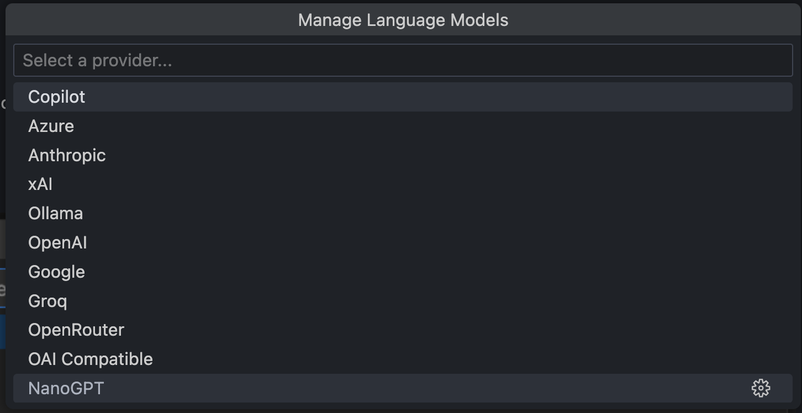
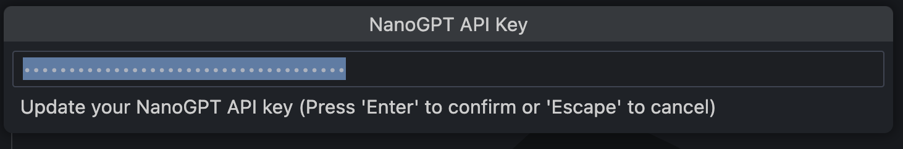
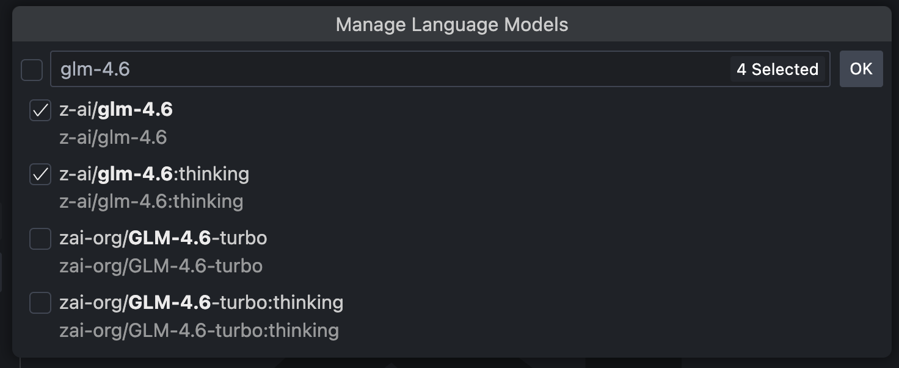

# [NanoGPT](https://nano-gpt.com) Provider for GitHub Copilot

Use your [NanoGPT](https://nano-gpt.com/) account with Github Copilot in VS Code!

Use NanoGPT to chat with advanced language models featuring reasoning, memory, search, and BYOK capabilities. Access OpenAI-compatible APIs with enhanced features like streaming reasoning, Polychat memory, Linkup search, and bring-your-own-key support.

## ✨ Key Features

- **🧠 Advanced Reasoning**: Configurable reasoning effort levels (low, medium, high)
- **💾 Memory System**: Persistent conversation memory with configurable expiration (1-365 days)
- **🔍 Smart Search**: Standard and deep search modes for enhanced information retrieval
- **🔐 BYOK Support**: Bring your own API keys from OpenAI, Anthropic, or Google
- **⚡ Real-time Streaming**: Live response streaming with thinking process display
- **🛠️ Tool Integration**: Full support for VS Code Language Model tools

## ⚡ Quick Start
1. Install the [Github Copilot Chat](https://marketplace.visualstudio.com/items?itemName=GitHub.copilot-chat) extension.
1. Install the [NanoGPT Provider for Github Copilot](https://marketplace.visualstudio.com/items?itemName=NanoGPT.nanogpt-copilot-provider) extension.
1. Open the Github Copilot Chat interface.
   - **Windows/Linux** default: <kbd>Ctrl</kbd> + <kbd>Alt</kbd> + <kbd>I</kbd>
   - **Mac** default: <kbd>Cmd</kbd> + <kbd>Ctrl</kbd> + <kbd>I</kbd>
   - or: View > Chat
1. Click the model picker and click "Manage Models...".

   

1. Select "NanoGPT" provider.

   

2. Provide your NanoGPT API Token. (Get yours here: https://nano-gpt.com/api)

   

3. Choose the models you want to add to the model picker. 🥳

    

## ✨ NanoGPT Features

### 🧠 Reasoning
Enable advanced reasoning capabilities with configurable effort levels:
- **Low**: Fast responses with basic reasoning
- **Medium**: Balanced reasoning and speed
- **High**: Deep analysis and complex reasoning

### 💭 Memory (Polychat)
Persistent conversation memory with configurable retention:
- Automatic conversation compression
- Configurable memory duration (1-365 days)
- Model suffixes: `:memory`, `:memory-30`, `:memory-90`

### 🔍 Search (Linkup)
Real-time web search integration:
- **Standard**: $0.006 per search
- **Deep**: $0.06 per search with enhanced results
- Model suffixes: `:online`, `:online/linkup-deep`

### 🔐 BYOK (Bring Your Own Key)
Use your own API keys from supported providers:
- OpenAI, Anthropic, Google support
- Secure credential storage
- Direct provider routing without fallbacks

### 🎯 Model Suffixes
Combine features using model suffixes:
- `gpt-4o:online:memory-30` - Search + 30-day memory
- `gpt-4o-mini:memory` - Default memory enabled
- `gpt-4o:online/linkup-deep` - Deep search enabled

## 🔧 Configuration

### Model Temperature
Configure custom temperature values for each model:
```json
{
  "nanogpt.modelTemperatures": {
    "gpt-4o": 0.7,
    "gpt-4o-mini": 0.5
  }
}
```

### Advanced Features
Configure NanoGPT-specific features:
```json
{
  "nanogpt.reasoning": {
    "enabled": true,
    "defaultEffort": "medium"
  },
  "nanogpt.memory": {
    "enabled": true,
    "defaultDays": 30
  },
  "nanogpt.search": {
    "enabled": true,
    "defaultMode": "standard"
  },
  "nanogpt.byok": {
    "enabled": false,
    "defaultProvider": "openai"
  }
}
```

## 🛠️ Development

```bash
git clone https://github.com/FrideyAlpha/nanogpt-copilot-provider.git

cd nanogpt-copilot-provider

npm install

npm run package

# Ctrl+Shift+P / Cmd+Shift+P > "Extensions: Install from VSIX" OR
code --install-extension nanogpt-copilot-provider.vsix
```

## 🔧 Configuration

Configure NanoGPT features through VS Code settings:

```json
{
  "nanogpt.modelTemperatures": {
    "gpt-4o": 0.7,
    "gpt-4o-mini": 0.5
  },
  "nanogpt.reasoning": {
    "enabled": true,
    "defaultEffort": "medium"
  },
  "nanogpt.memory": {
    "enabled": true,
    "defaultDays": 30
  },
  "nanogpt.search": {
    "enabled": true,
    "defaultMode": "standard"
  },
  "nanogpt.byok": {
    "enabled": false,
    "defaultProvider": "openai"
  }
}
```

### Available Scripts

- `npm run compile` - Compile TypeScript
- `npm run watch` - Watch mode compilation
- `npm run lint` - Lint code with ESLint
- `npm run format` - Format code with Prettier
- `npm run test` - Run tests
- `npm run package` - Package extension for distribution

## 🚀 Features in Detail

### Reasoning System
NanoGPT's advanced reasoning system allows models to think through complex problems step-by-step:
- **Low Effort**: Quick responses for simple tasks
- **Medium Effort**: Balanced reasoning for most use cases
- **High Effort**: Deep analysis for complex problem-solving

### Memory Configuration
Persistent conversation memory helps maintain context across sessions:
- Configurable expiration from 1 to 365 days
- Automatic context retrieval for relevant conversations
- Privacy-focused with user-controlled retention

### Search Capabilities
Enhanced information retrieval with multiple search modes:
- **Standard**: Fast web search for current information
- **Deep**: Comprehensive research with multiple sources
- Real-time fact verification and citation

### BYOK (Bring Your Own Key)
Use your existing API keys from major providers:
- **OpenAI**: GPT-4, GPT-3.5-turbo models
- **Anthropic**: Claude models
- **Google**: Gemini models
- Seamless switching between providers

## 🐛 Troubleshooting

### Common Issues

**Extension not loading:**
- Ensure you have GitHub Copilot Chat extension installed
- Check VS Code developer console for errors
- Verify extension activation: `onLanguageModelChat:nanogpt`

**API Key Issues:**
- Verify your NanoGPT API key is correct
- Check network connectivity to nano-gpt.com
- Ensure API key has proper permissions

**Model Loading Problems:**
- Try refreshing the model list
- Check your account's model access permissions
- Verify API quota and billing status

**Configuration Not Saving:**
- Check VS Code workspace permissions
- Verify configuration schema is valid
- Restart VS Code after configuration changes

## 🤝 Contributing

We welcome contributions! Please see our [Contributing Guide](CONTRIBUTING.md) for details.

### Development Setup
1. Fork the repository
2. Create a feature branch
3. Make your changes
4. Add tests for new functionality
5. Run linting and tests
6. Submit a pull request

## 📄 License

This project is licensed under the MIT License - see the [LICENSE](LICENSE) file for details.

## 🙏 Acknowledgments
- Original project by [@mcowger](https://github.com/mcowger)
- VS Code Extension API team
- OpenAI for the Chat Completions API
- The open-source community

## 📞 Support

- **Documentation**: https://docs.nano-gpt.com
- **Issues**: https://github.com/FrideyAlpha/nanogpt-copilot-provider/issues
- **Discussions**: https://github.com/FrideyAlpha/nanogpt-copilot-provider/discussions
- **Email**: support@nano-gpt.com

---

**Made with ❤️ by the NanoGPT User**
